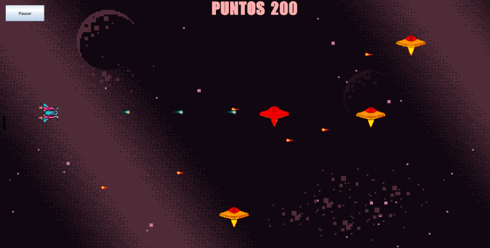

# 🚀 The Last Starfighter

Juego 2D de tipo **shoot 'em up** desarrollado en Java como proyecto académico
para la materia Programación Orientada a Objetos.

El proyecto aplica conceptos de POO, patrones de diseño, concurrencia,
persistencia con SQLite y desarrollo de interfaces gráficas mediante Java Swing.

## 🎮 Sobre el juego

The Last Starfighter está inspirado en *The Super Dimension Fortress Macross*.

El jugador controla una nave espacial y debe enfrentarse a diferentes tipos
de enemigos, cada uno con comportamientos y patrones de movimiento propios.

El objetivo es conseguir el mayor puntaje posible antes de perder las cinco vidas
y alcanzar el ranking de mejores jugadores.

## ✨ Características principales

- Movimiento y disparo de la nave.
- Diferentes tipos de enemigos.
- Patrones de movimiento y ataque variables.
- Sistema de colisiones.
- Sistema de vidas y puntaje.
- Evolución temporal de la nave.
- Power-ups.
- Enemigos con estados de visibilidad.
- Fondo animado.
- Música y efectos de sonido.
- Ranking persistente de mejores puntajes.
- Persistencia mediante SQLite.

## 🛠️ Tecnologías

- **Lenguaje:** Java
- **JDK probado:** JDK 25
- **Interfaz gráfica:** Java Swing
- **Base de datos:** SQLite
- **IDE:** Visual Studio Code
- **Control de versiones:** Git y GitHub

## 🧠 Programación Orientada a Objetos

### Abstracción

La clase `personaje_base` concentra atributos y comportamientos compartidos
por los distintos personajes del juego, como posición, vida, velocidad,
colisiones y recepción de daño.

### Herencia

`spaceship_1`, `Enemigo_Violeta`, `Enemigo_Rojo` y `Enemigo_Fantasma`
heredan de `personaje_base`, reutilizando comportamiento común y
especializando sus propias acciones.

### Polimorfismo

Las diferentes implementaciones permiten tratar los personajes mediante
una interfaz común mientras cada tipo ejecuta su comportamiento específico.

### Encapsulamiento

El estado interno de los personajes se mantiene encapsulado y se accede
mediante los métodos definidos por cada clase.

## 🧩 Patrones de diseño

### Singleton

Utilizado para mantener una única instancia de la conexión a SQLite y
del `AudioManager`.

### Factory Method

Utilizado para desacoplar la creación de los diferentes tipos de enemigos
del resto de la lógica del juego.

### Decorator

Implementado para modificar dinámicamente las capacidades de la nave mediante
power-ups y el estado `NaveEvolucionada`.

### Strategy

Utilizado para representar distintos patrones de movimiento de los enemigos.
El enemigo fantasma puede cambiar dinámicamente su estrategia dependiendo
de su estado.

### DAO

Utilizado para separar la lógica de acceso a SQLite del resto de la aplicación
y administrar el ranking de mejores puntajes.

## 🧵 Concurrencia

El proyecto utiliza distintos mecanismos para mantener separadas la lógica
del juego y la interfaz gráfica:

- Game Loop ejecutado aproximadamente a 60 FPS.
- Event Dispatch Thread (EDT) de Swing para la interfaz.
- `java.util.Timer` y `TimerTask` para determinadas mecánicas.
- `SwingUtilities.invokeLater()` para sincronizar actualizaciones con el EDT.

## 🗃️ Persistencia

Los cinco mejores puntajes se almacenan en una base de datos SQLite.

El acceso a los datos se encuentra encapsulado mediante el patrón DAO.

## 🖼️ Diagramas

### Implementación de Decorator

### Prototipo de la interfaz

## ▶️ Ejecución

### Requisitos

- JDK XX
- Visual Studio Code con Java Extension Pack

## ▶️ Ejecución

### Requisitos

- JDK 25
- Visual Studio Code o cualquier IDE compatible con Java

## ▶️ Ejecución

### Requisitos

- JDK 25
- Visual Studio Code
- Extension Pack for Java

### Ejecutar

1. Clonar el repositorio.
2. Abrir la carpeta del proyecto en Visual Studio Code.
3. Ir a **Run and Debug**.
4. Seleccionar **Ejecutar The Last Starfighter**.
5. Presionar ▶️.

## 🎓 Contexto académico

Proyecto desarrollado de forma grupal para la materia **Programación Orientada
a Objetos**.

### Integrantes

- Marcos Gonzalez Bonetto
- Lautaro Usqueda Carrizo
- Danna Berenice Katzen